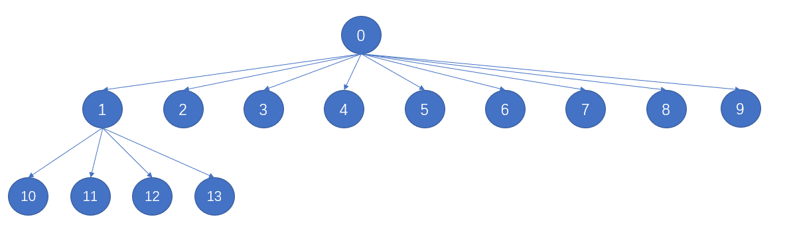

# [440. 字典序的第K小数字](https://leetcode-cn.com/problems/k-th-smallest-in-lexicographical-order/)

---

难度 `困难` | 个人标签 ❌㊙️🔑 | 获赞 `126`

---

## Description

<style>
section pre{
    background-color: #eee;
    border: 1px solid #ddd;
    padding:10px;
    border-radius: 5px;
}
</style>
<section>
<p>给定整数&nbsp;<code>n</code>&nbsp;和&nbsp;<code>k</code>，找到&nbsp;<code>1</code>&nbsp;到&nbsp;<code>n</code>&nbsp;中字典序第&nbsp;<code>k</code>&nbsp;小的数字。</p>
<p>注意：1 ≤ k ≤ n ≤ 10<sup>9</sup>。</p>
<p><strong>示例 :</strong></p>
<pre><strong>输入:</strong>
n: 13   k: 2
<strong>输出:</strong>
10
<strong>解释:</strong>
字典序的排列是 [1, 10, 11, 12, 13, 2, 3, 4, 5, 6, 7, 8, 9]，所以第二小的数字是 10。
</pre>
</section>

## My Solution

```python
class Solution:
    def findKthNumber(self, n: int, k: int) -> int:
        curr=0
        def count(p,n,k):
            nonlocal curr
            p*=10
            for i in range(0,10):
                if p+i<=n: 
                    curr+=1
                    if curr==k:return p+i
                    res=count(p+i,n,k)
                    if curr==k:return res
            return 0

        for i in range(1,10): 
            if i<=n: 
                curr+=1
                if curr==k: return i
                res=count(i,n,k)
                if curr==k: return res

        return res
```

这是我的做法，会超时，只能过一半左右的测试样例。

以下是一个很好的方法，十叉树，从别人那里学习的：

```python
class Solution:
    def findKthNumber(self, n: int, k: int) -> int:
        def count(n,node1,node2):
            steps=0
            while node1<=n:
                steps+=min(n+1,node2)-node1
                node1*=10
                node2*=10
            return steps
        
        curr=1
        k-=1
        while k>0:
            steps=count(n,curr,curr+1)
            if steps<=k:
                k-=steps
                curr+=1
            else:
                k-=1
                curr*=10
        return curr
```

具体的思路是，先计算某个节点1到某个节点2中间有多少步（也就是包含节点一及其子节点一共有多少节点），如果算出来的步数还不够目标K，那么说明我们需要在同一层往右寻找节点及其子节点（因为节点1下面的全数完还不够）；如果算出来的步数已经够目标K，那么说明目标就在节点1下面某个节点，于是我们算上节点1这一步以后继续往它下一层寻找（`k-=1;curr*=10`）

